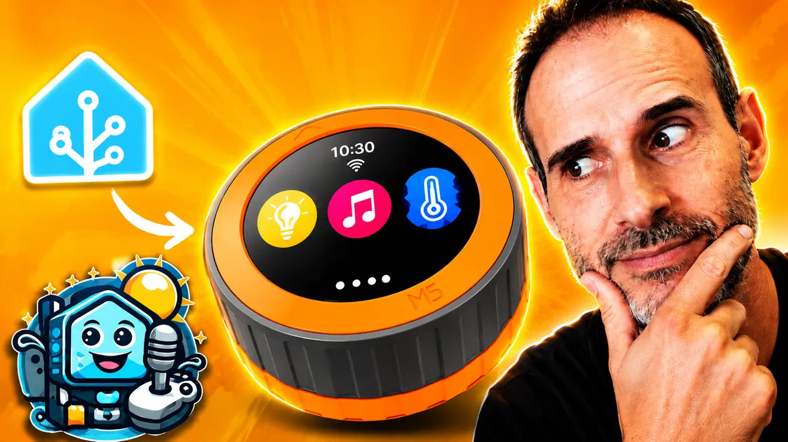

<div align="center">


# Home Assistant Controller for M5Stack Dial

### A circular Home Assistant controller for M5Stack Dial, built with ESPHome and LVGL.

**Maintained by [Glooob Domo](https://github.com/Glooob-domo)** — custom firmware, UI and Home Assistant integrations for the M5Stack Dial.

[](https://esphome.io/)
[](https://www.espressif.com/)
[](#hardware)
[](#license)

</div>

This firmware turns an M5Stack Dial into a physical Home Assistant controller. The rotary wheel, touch screen and front button make everyday actions—such as checking the room, changing a light, adjusting the climate or controlling music—available without repeatedly opening a phone dashboard.

**Glooob Domo** develops and publishes this version: configurable entity lists, live menu status, room temperatures, garage controls, encoder tuning, localized UI, SendSpin album art support and the pages documented below. It is not an official project of M5Stack, ESPHome, or Home Assistant.

## Origins and credits

This firmware follows a chain of community forks. Each step kept the MIT license and built on the previous work.

| Step | Author | Contribution |
| --- | --- | --- |
| 1 | [Jason Wen](https://github.com/Jasionf) | Original [**Smart Home Button**](https://github.com/Jasionf/smart-home-button): M5Stack Dial hardware, ESPHome/LVGL foundation, and the first Clock, Light, Climate, Music and Timer pages. |
| 2 | [hectorzin](https://github.com/hectorzin) | Home Assistant Controller derivative: configurable `dial_*` entity lists, optional menu pages, live menu subtitles, AQI on Clock, improved navigation, screen idle management and SendSpin album-art support. [Article](https://hectorzin.com/en/posts/m5stack-dial-home-assistant-esphome-controller) · [Video](https://www.youtube.com/watch?v=EskhrfUTLOM) |
| 3 | **[Glooob Domo](https://github.com/Glooob-domo)** | This repository: room temperatures, garage/gate page, one-step encoder tuning, localized date format, seconds ring on Clock, scene and garage UI refinements, French-first config template and ongoing maintenance. |

Many thanks to **Jason Wen** and **hectorzin** for creating and sharing the foundation this project builds on.

## Features

- Clock with a seconds progress ring, localized date format and weather from Home Assistant.
- Air-quality index (AQI) from a Home Assistant sensor.
- Circular menu navigation with the encoder, touch gestures and front button.
- Configurable Home Assistant lights through `dial_lights`.
- Climate control through `dial_climates`.
- Cover / shutter control through `dial_covers`.
- Garage / gate control through `dial_garages` (open, close and stop — no position percentage).
- Outlet / switch control through `dial_switches`.
- Scene and script activation through `dial_scenes`.
- Room temperatures through `dial_temperatures`.
- Media playback, volume and metadata through `dial_media_players`.
- Home Assistant timer control through a `timer_entity`.
- Menu subtitles based on live Home Assistant states.
- Automatic return to the clock after inactivity.
- Configurable backlight dimming and screen-off behaviour.
- Wake from dimmed or screen-off state without leaving the current page.
- Visual and audible notification when a timer finishes.

## Gallery

| | | | |
| --- | --- | --- | --- |
|  |  |  |  |
|  |  | | |

## Pages

| Page | Description |
| --- | --- |
| Clock | Shows the time, a seconds ring, localized date, weather and AQI from Home Assistant. |
| Menu | Circular navigation with live subtitles for configured Home Assistant features. |
| Lights | Controls the Home Assistant light entities declared in `dial_lights`. One light opens the page directly; several open a selector first. |
| Covers | Controls the Home Assistant cover entities declared in `dial_covers`. Same skip-if-one rule as lights. |
| Garage | Controls garage / gate covers declared in `dial_garages`. Open, close and stop only — no position arc. |
| Outlets | Toggles `switch` or `input_boolean` entities declared in `dial_switches`. |
| Scenes | Runs `scene` or `script` entities declared in `dial_scenes`. |
| Rooms | Shows temperatures from `sensor` or `climate` entities declared in `dial_temperatures`. The encoder steps through rooms. |
| AC | Controls the Home Assistant climate entities declared in `dial_climates`. Same skip-if-one rule as lights. |
| Music | Controls the Home Assistant media players declared in `dial_media_players`. Same skip-if-one rule as lights. |
| Timer | Uses `timer_entity` as the source of truth for a Home Assistant countdown timer. |

## Hardware

The firmware targets the M5Stack Dial platform and its ESP32-S3 controller. The configuration uses the Dial's 240 × 240 GC9A01A round display, FT5x06 capacitive touch controller, rotary encoder, front button, PCF8563 RTC, buzzer and display backlight.

M5Stack Dial V1.1 is the tested target. GPIO46 power hold is configured for V1.1 so the device remains powered when running on battery. Other revisions may work, but are not currently verified by Glooob Domo.

## Requirements

- A compatible M5Stack Dial.
- Home Assistant.
- ESPHome.
- Wi-Fi access for the Dial.
- Home Assistant entities only for the features and information you want to enable.

Weather and AQI are optional: leave them as `weather.disabled` / `sensor.disabled` (or point at unavailable entities) and Clock shows `--`. Timer, AC, Music, Lights and Covers are also optional; those menu entries disappear when the matching line in `m5-dial.yaml` stays `*.disabled` or, for list-based pages, when the list is empty.

## Quick installation

You only add **one file** to ESPHome. ESPHome downloads the firmware from GitHub; you do not copy the rest of this repository.

1. In the ESPHome dashboard, create a device and paste [`m5-dial.yaml`](m5-dial.yaml).
2. Put Wi-Fi, `api_encryption_key` and `ota_password` in `secrets.yaml`.
3. In that same YAML, set `ui_language`, replace `timer_entity` / `weather_entity` / `aqi_entity` when you want those fields, and uncomment the `dial_*` blocks you need. Omit a list entirely to hide that menu page (you do not need empty `dial_*: []` entries).
4. Install over USB the first time, then use OTA.

Example of the fields you edit:

```yaml
substitutions:
  timezone: Europe/Paris
  ui_language: fr
  encoder_resolution: "1"
  weather_entity: weather.maison
  aqi_entity: sensor.aqi_salon
  timer_entity: timer.dial

# --- Lumière / Light ---
dial_lights:
  - entity_id: light.salon
    name: Salon

# --- Chauffage / Climate ---
dial_climates:
  - entity_id: climate.salon
    name: Salon

# --- Media Player ---
dial_media_players:
  - entity_id: media_player.salon
    name: Salon

# Pages optionnelles : ajoutez seulement les listes dont vous avez besoin.
# Sans dial_covers, dial_garages, etc., la page reste masquée.

packages:
  m5_dial:
    url: https://github.com/Glooob-domo/m5stack-dial-home-assistant
    ref: main
    files:
      - dial.yaml
    refresh: 0s
```

Changing an entity ID requires a recompile (or OTA). `ref: main` follows the published branch; pin a tag or commit when you want a frozen version.

For all fields, defaults and advanced cases, see [the configuration reference](docs/configuration.md).

## Navigation

The Dial supports the rotary encoder, the front button and horizontal touch gestures. In general, a short press opens or accepts, a rapid double press performs Back, and a long press has no action. Touch widgets retain their page-specific actions.

| Context | Rotate | Short press | Double press / Touch |
| --- | --- | --- | --- |
| Clock (Home) | No action | Opens Menu | Long press: no action. Swipe left or right opens Menu. |
| Menu | Moves the circular selection | Opens the selected page; Home returns to Clock | Tap a visible menu item to open it. Swipe left confirms; swipe right returns to Clock. |
| Lights | Changes brightness or the active selector value | Opens/accepts the selected light, according to context | Double press or swipe right goes back. Touch controls power, colour picker and colour confirmation. |
| Covers | Changes position | Toggles open/close, or stops if moving | Double press or swipe right goes back. Touch sends open, stop and close. |
| Garage | No action | Stop if moving, otherwise no action | Double press or swipe right goes back. Touch sends open, close and stop. |
| Outlets | No action | Toggles the switch | Double press or swipe right goes back. Tap the centre control to toggle. |
| Scenes | No action | Activates the scene or script | Double press or swipe right goes back. Tap ACTIVATE to run it. |
| Rooms | Steps through rooms | Goes back | Double press or swipe right goes back. |
| AC | Changes the selected value | Accepts or confirms the current edit | Double press or swipe right goes back. Touch selects controls and toggles power, fan mode or HVAC mode. |
| Music | Changes volume | Accepts the current action where applicable | Double press or swipe right goes back. Touch controls playback and transport. |
| Timer | Adjusts the selected duration unit while the timer is idle | Starts, pauses, resumes or clears the finished state | Double press or swipe right goes back. Touch selects hours/minutes/seconds and accesses reset/cancel. |

The first encoder turn, button press or touch gesture after the screen has dimmed or turned off only wakes the display; repeat the action to control the interface.

```yaml
substitutions:
  encoder_resolution: "1"
```

`encoder_resolution` is `1`, `2` or `4`. The default `1` is one UI step per mechanical click. Use `4` if you want a more sensitive wheel.

On Lights, Covers, AC and Music — the pages that edit an entity value — each step changes the value by `light_brightness_step`, `cover_position_step`, `climate_temperature_step` or `music_volume_step` (defaults `1%`, `5%`, `1°C`, `10%`). See [the configuration reference](docs/configuration.md) for details.

## Screen management

The package offers four substitutions for idle behaviour:

```yaml
substitutions:
  screen_dim_timeout: 45s
  screen_return_timeout: 5min
  screen_off_timeout: 30min
  screen_dim_brightness: "20%"
```

`DIM` lowers the backlight and preserves the current page. `RETURN` intentionally navigates to Clock. `OFF` turns off only the backlight and preserves the current page. They are independent stages. Set any timeout to `0s` to disable that stage. When `OFF` is enabled, its effective timeout is raised if necessary so it is not earlier than either enabled DIM or RETURN timeout.

An active Home Assistant timer blocks only automatic return to the clock; a paused timer does not. DIM and OFF continue to work for either state. When the timer finishes, the Dial wakes, opens Timer and runs its blink-and-beep feedback.

## Live menu status

The Menu is more than a launcher: its current selection shows a live subtitle. Timer shows remaining time or its state; Lights shows a single light's brightness or how many configured lights are on; Covers and Garage show open/closed or how many are open; Outlets show on/off; Scenes show the name or how many are configured; Rooms show the temperature or how many rooms are configured; AC shows HVAC mode and target temperature; Music shows title or playback state; and Home shows `Clock`.

## Feature notes

### Clock

The outer arc tracks **seconds** and refreshes every 5 s. The date line follows `ui_language`: English uses month/day (`Mon  09/02`); French, Spanish, German and Italian use day/month (`Mar  02/09`).

A small red dot appears above the time only while the Dial has lost its connection to Home Assistant (checked every 5 s), so a Wi-Fi drop or a Home Assistant restart doesn't look like a frozen or broken device. It disappears as soon as the connection is back.

### Music

The Music page is controlled through `dial_media_players`. Home Assistant provides playback state, play/pause and transport actions, volume, title and metadata, plus duration and position when available.

Until album artwork arrives, the page shows the same **Home Assistant logo** as the boot screen. **SendSpin** is optional: when a compatible source (for example Music Assistant with SendSpin enabled) pushes artwork to the Dial, a 100 × 100 album cover replaces the logo with a short fade. Album art is kept small for the Dial's memory budget. Without SendSpin, playback and metadata still work — only the cover image stays on the logo.

### Climate

Available climate controls depend on the selected entity. The page reads and changes target temperature, and uses the entity's advertised HVAC and fan modes when available. Do not expect a control that the selected Home Assistant climate integration does not expose.

### Covers

The encoder sets position in 5% steps (`encoder_resolution: "1"` gives one step per mechanical click). A short press toggles open/close, or stops if the cover is already moving. Touch buttons send open, stop and close.

### Garage

Garage and gate entities use a separate page from shutters: **open** and **close** buttons in the centre, **stop** below. There is no position arc or percentage. The encoder does nothing on this page; a short press stops the cover while it is moving.

### Scenes

One scene or script opens the page directly; several open a selector first. A large **ACTIVATE** button runs the entity; a short press or tap does the same.

### Timer

`timer_entity` is the source of truth. The same timer can be controlled from Home Assistant dashboards and automations as well as the Dial. A YAML-defined Home Assistant timer may use `restore: true`, but it is optional.

### Battery

The package enables GPIO46 at boot for M5Dial V1.1 battery power hold. This keeps that revision powered after wake when running on battery.

## Troubleshooting

- **Device does not appear in Home Assistant:** confirm Wi-Fi, API connectivity and a valid `api_encryption_key`.
- **A menu item is hidden:** add at least one entry to the matching list (`dial_lights`, `dial_climates`, `dial_media_players`, `dial_covers`, `dial_garages`, `dial_switches`, `dial_scenes`, `dial_temperatures`), or set `timer_entity` for Timer. Empty lists hide that page.
- **AQI shows `--`:** use an existing numeric sensor for `aqi_entity`.
- **A feature is unavailable:** check that its configured entity exists and is available in Home Assistant.
- **Music is unavailable:** use the entity that actually plays audio and exposes its media state.
- **Album art stays on the Home Assistant logo:** SendSpin must be enabled on the music source and connected to the Dial; without it, only the logo placeholder is shown.
- **Timer is unavailable:** create or enable the referenced Home Assistant Timer helper.
- **Package changes are missing:** use `refresh: 0s` while testing, then reload or recompile the ESPHome configuration.
- **Fonts, glyphs or compilation fail:** ensure the first build can download its dependencies and use the ESPHome version in `requirements.txt`.
- **First installation fails over the network:** flash over USB first, then use ESPHome OTA updates.

## Project structure

```text
m5stack-dial-home-assistant/
├── m5-dial.yaml               # Single ESPHome device file (GitHub package + entities)
├── m5-dial.local.yaml         # Compile this clone (not used in the ESPHome dashboard)
├── dial.yaml                 # Firmware package (pulled from GitHub)
├── secrets.example.yaml      # Example credentials for local development
├── requirements.txt          # ESPHome version used by this project
├── src/
│   ├── main/                 # Hardware, defaults, idle logic
│   ├── pages/                # LVGL pages for clock, menu and features
│   └── assets/               # Fonts and embedded images
├── components/               # Local ESPHome components, including SendSpin
├── docs/                     # Configuration and maintenance documentation
├── hardware/                 # Hardware-related assets
├── LICENSE
└── THIRD_PARTY_NOTICES.md
```

## Development and customisation

This section is for people changing the firmware. Create a local `secrets.yaml` from `secrets.example.yaml`, then compile **this clone** (the ESPHome dashboard uses `m5-dial.yaml` + GitHub instead):

```bash
python -m venv .venv
# Activate .venv (Scripts\Activate.ps1 on Windows, bin/activate on macOS/Linux)
python -m pip install -r requirements.txt
esphome config m5-dial.local.yaml
esphome compile m5-dial.local.yaml
```

Page customisation lives under `src/pages/`; hardware and idle behaviour are under `src/main/`. Keep local secrets out of Git.

## Video

A setup and demo video for **this Glooob Domo version** is coming soon on the **Glooob Domo** YouTube channel.

For an earlier walkthrough of the hectorzin derivative (architecture and first HA integrations), see:

- [hectorzin — article](https://hectorzin.com/en/posts/m5stack-dial-home-assistant-esphome-controller)
- [hectorzin — YouTube demo](https://www.youtube.com/watch?v=EskhrfUTLOM)

[](https://www.youtube.com/watch?v=EskhrfUTLOM)

## Documentation

- [Configuration reference](docs/configuration.md)
- [Project structure](docs/project-structure.md)
- [License](LICENSE)
- [Third-party notices](THIRD_PARTY_NOTICES.md)

## Credits and license

Home Assistant Controller for M5Stack Dial is based on the original [**Smart Home Button** project](https://github.com/Jasionf/smart-home-button) by [Jason Wen](https://github.com/Jasionf), then extended by [hectorzin](https://github.com/hectorzin) as a configurable Home Assistant controller.

This version is developed and maintained by **[Glooob Domo](https://github.com/Glooob-domo)**. You may fork, modify and republish it under the [MIT License](LICENSE), provided the original copyright notice and license are kept. See [THIRD_PARTY_NOTICES.md](THIRD_PARTY_NOTICES.md) for SendSpin, fonts and other third-party components.
